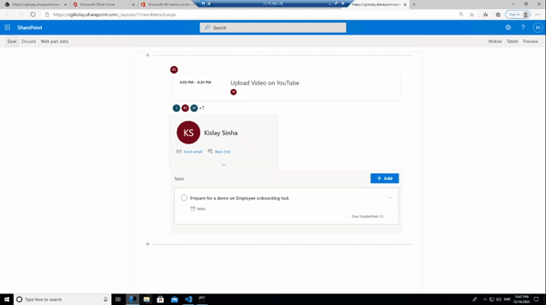

# SharePoint Framework with Microsoft Graph ToolKit 2.0

## Summary

This uses SharePoint Development Framework and Microsoft Graph Toolkit 2.0
Language used is TypeScript
This showcases how to develop an SPFx App and load Microsoft Graph Toolkit components in SPFx web part
Details of the source code and how to run etc is also described in video here https://youtu.be/UjsxLvIEZdA

## Used SharePoint Framework Version

## Applies to

- [SharePoint Framework](https://aka.ms/spfx)
- [Microsoft 365 tenant](https://docs.microsoft.com/en-us/sharepoint/dev/spfx/set-up-your-developer-tenant)

> Get your own free development tenant by subscribing to [Microsoft 365 developer program](http://aka.ms/o365devprogram)

## Prerequisites

> Any special pre-requisites?

## Solution

Solution|Author(s)
--------|---------
SPFX-MGT | Kislay Sinha (Kislay Sinha, CGI, https://twitter.com/SinhaKislay)

## Version history

Version|Date|Comments
-------|----|--------
1.0|December 15, 2020|Initial release

## Disclaimer

**THIS CODE IS PROVIDED *AS IS* WITHOUT WARRANTY OF ANY KIND, EITHER EXPRESS OR IMPLIED, INCLUDING ANY IMPLIED WARRANTIES OF FITNESS FOR A PARTICULAR PURPOSE, MERCHANTABILITY, OR NON-INFRINGEMENT.**

---

## Minimal Path to Awesome

- Clone this repository
- Ensure that you are at the solution folder
- In the file serve.json chnage the tenant url to your tenant url https://<<yourtenant.sharepoint.com/_layouts/15/workbench.aspx
- Go to folder .\sharepoint\solution and install the package file spfx-mgt.sppkg in SharePoint Tenant in Apps in SharePoint, for more details have a look at https://youtu.be/UjsxLvIEZdA
- Also grant permissions for API if not done already in SharePoint Tenant Admin site

- in the command-line run:
  - **npm install**
  - **gulp serve**
- Add the web part "spfx-mgt" 

## Features and Detail Description

TBD

> Notice that better pictures and documentation will increase the sample usage and the value you are providing for others. Thanks for your submissions advance.

> Share your web part with others through Microsoft 365 Patterns and Practices program to get visibility and exposure. More details on the community, open-source projects and other activities from http://aka.ms/m365pnp.

## References

- [Getting started with SharePoint Framework](https://docs.microsoft.com/en-us/sharepoint/dev/spfx/set-up-your-developer-tenant)
- [Building for Microsoft teams](https://docs.microsoft.com/en-us/sharepoint/dev/spfx/build-for-teams-overview)
- [Use Microsoft Graph in your solution](https://docs.microsoft.com/en-us/sharepoint/dev/spfx/web-parts/get-started/using-microsoft-graph-apis)
- [Publish SharePoint Framework applications to the Marketplace](https://docs.microsoft.com/en-us/sharepoint/dev/spfx/publish-to-marketplace-overview)
- [Microsoft 365 Patterns and Practices](https://aka.ms/m365pnp) - Guidance, tooling, samples and open-source controls for your Microsoft 365 development
